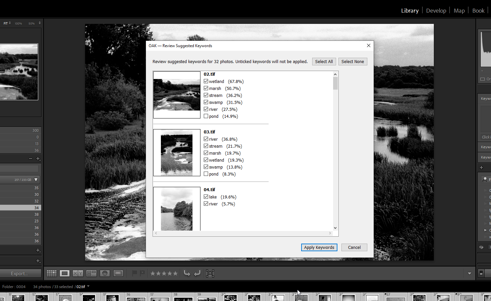

# OAK — Open Auto Keywording for Lightroom Classic

OAK suggests keywords for your photos using Googles SigLIP 2 AI model.

It runs **entirely on your own machine**, no cloud, no subscription, no images ever leave your computer.



## Full disclosure

This was essentially vibe coded in about 2 hours, mainly because claude has more enthusisam for writing lua than I do. 

It was written to fill my own needs, It lacks polish, packaging and testing outside of a single enviroment.

You will need at least a basic understanding of how to install python in order to use it.

If you are going to run something random off the internet against your priceless collection of images, its a good idea to audit the source code yourself. Its also a good idea to have a [backup](https://helpx.adobe.com/uk/lightroom-classic/help/back-catalog.html).

## How it works

OAK has two parts:

1. **A Lightroom Classic plugin** (`plugin/oak.lrplugin`) that exports small previews of your selected photos, shows a review dialog, and writes approved keywords into the catalog.
2. **A local inference service** (`service/`) — a small Python server running [SigLIP 2](https://huggingface.co/google/siglip2-base-patch16-384) (Apache-2.0), which scores each photo against a keyword vocabulary *you control*. The plugin starts and stops it for you.

Because it's zero-shot matching against your own vocabulary, OAK can be as general ("landscape", "sunset") or as specific ("labrador retriever", "red kite", "long exposure") as you want.

## Requirements

- Windows (No concrete reason why it won't run on OSX but i haven't tried it)
- Adobe Lightroom Classic 6 or newer
- [Python](https://www.python.org/downloads/) 3.10 or newer
- ~2 GB disk space (Python packages + the model, downloaded on first run)
- No GPU required — tagging takes roughly 1–2 seconds per photo on CPU

## Installation

### 1. Get the code

Clone or download this repository, e.g. to `C:\Users\you\oak`. The plugin expects the folder layout as-is (it finds the service relative to its own location), so don't move `plugin/` or `service/` around independently.

### 2. Set up the Python service

Open a terminal in the repo folder and run:

```powershell
py -m venv .venv
.\.venv\Scripts\pip install -r service\requirements.txt
```

This installs PyTorch (CPU build), Transformers and FastAPI into a virtual environment inside the repo — nothing is installed system-wide.

### 3. Install the plugin in Lightroom

1. In Lightroom Classic, open **File → Plug-in Manager**
2. Click **Add**
3. Select the `plugin\oak.lrplugin` folder
4. Click **Done**

That's it. You don't need to start the service yourself — the plugin launches it on demand.

## Usage

1. Select one or more photos in the Library
2. Run **Library → Plug-in Extras → OAK: Suggest Keywords for Selected Photos**
3. The first run starts the service and loads the model — this takes up to a minute (and the very first time ever, the ~800 MB model is downloaded). After that it's fast.
4. Review the suggestions: every keyword has a checkbox (ticked by default) with its confidence score. Untick anything wrong, or use **Select All / Select None**.
5. Missed something? Type it into the **Add keywords** field on any photo (comma-separated, e.g. `red kite, gliding`). Typed keywords are applied to that photo *and* added to the vocabulary automatically, so OAK can suggest them by itself next time.
6. Click **Apply Keywords**.

Applied keywords appear in the Keywording panel as e.g. `mountain < OAK` — that's Lightroom showing the keyword lives under the `OAK` parent. The parent keyword is excluded from export, so your exported files just get `mountain`.

## Settings

Open **File → Plug-in Manager → OAK — Open Auto Keywording**:

- **Service** — shows whether the local service is running, with Start / Stop / Refresh buttons. Stopping it frees the memory the model uses; it restarts automatically next time you run OAK.
- **Service URL** — where the service listens (default `http://127.0.0.1:8420`). Only change this if the port clashes with something else.
- **Max keywords per photo** — cap on suggestions per photo (default 8).
- **Vocabulary** — the full list of keywords OAK considers, editable right in the dialog. **Save Vocabulary** writes the file and hot-reloads the running service.

## Tuning the vocabulary

The vocabulary is the single biggest lever on result quality. It's a plain text file (`service\vocab.txt`), one keyword per line, `#` for comments. The repo ships with a ~470-term starter vocabulary covering nature, landscapes, animals, 70 dog breeds, birds, camera gear and general subjects.

Tips:

- **Specific beats generic.** "labrador retriever" scores far higher on a photo of one than "dog" does — the model rewards precision.
- **Phrases are fine.** "long exposure waterfall", "snow-capped mountain", "golden hour" all work.
- **Disambiguate homonyms.** Prefer "crane bird" over "crane" if you never photograph construction sites.
- **Scale freely.** Thousands of keywords cost almost nothing per photo — the vocabulary is embedded once at startup (and on reload), not per image.
- **Teach as you go.** Keywords you type in the review dialog are appended to the vocabulary automatically (under an `# added from review` section), so corrections become future suggestions.
- **Prune what you never shoot.** Fewer irrelevant candidates means less noise in the suggestions.

## Troubleshooting

**The menu item is greyed out** — select at least one photo.

**"OAK service could not be started"** — check `service\oak_service.log`. Common causes: the venv wasn't created (redo installation step 2), or the model is still downloading on a slow connection (try again in a few minutes).

**No keywords suggested for a photo** — the photo's content probably isn't in the vocabulary. Add relevant terms in the settings and save.

**First run is very slow** — normal. The model (~800 MB) downloads once to your Hugging Face cache, and each service start takes ~30–60 s to load it into memory. Subsequent tagging is 1–2 s per photo.

**Something's stuck** — stop the service from the Plug-in Manager (or end the `pythonw.exe` process in Task Manager) and run OAK again.

## Privacy

Everything runs locally. The only network access is the one-time model download from Hugging Face on first start.

## License

MIT — see [LICENSE](LICENSE). The SigLIP 2 model is released by Google under Apache-2.0.
